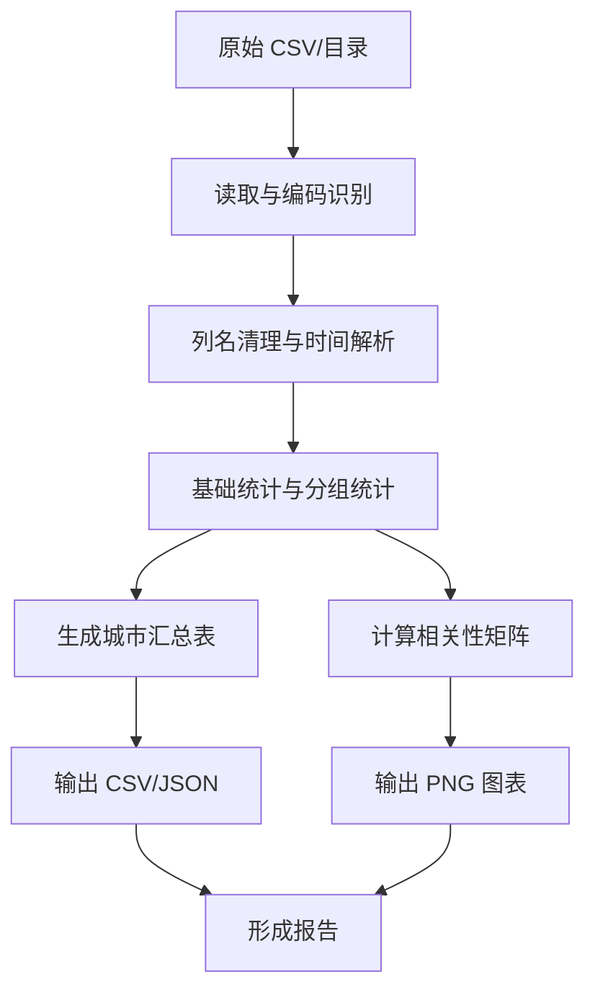

# 项目一概要设计：气象原始数据分析

## 目录

- 1. 设计目标
- 2. 总体架构
- 3. 模块职责
- 4. 技术选型
- 5. 数据流说明
- 6. 文件组织
- 7. 设计原则
- 8. 处理流程图
- 9. 异常处理策略
- 10. 扩展性说明
## 1. 设计目标

本报告的目标是构建一个简单、稳定、可复用的气象数据分析流程。设计上不追求复杂系统，而是强调数据处理过程的完整性、结果的可解释性以及文档交付的规范性。

## 2. 总体架构

项目采用“输入数据 -> 数据标准化 -> 统计分析 -> 可视化输出 -> 结果归档”的架构。各步骤之间通过标准化的数据表传递信息，保证处理逻辑清晰，便于调试和复用。

### 2.1 输入层

输入层接收原始 CSV 文件或包含多个 CSV 文件的目录。主要来源为 `气象原始数据\data`，其中既包含观测数据，也包含省级实况数据。

### 2.2 处理层

处理层分为四个核心模块：

- 数据读取模块：负责编码识别、列名清理和时间字段解析
- 数据统计模块：负责整体统计和分组统计
- 可视化模块：负责生成趋势图和相关性热力图
- 报告模块：负责整理输出文件和摘要信息

### 2.3 输出层

输出层保存统计结果、图表结果和摘要信息。所有输出文件采用清晰命名方式，以便用户直接查找并用于写作或汇报。

## 3. 模块职责

### 3.1 数据读取模块

该模块负责读取 CSV 文件，并统一处理列名和时间字段。它支持单文件和目录批量两种输入方式，是整个流程的入口。

### 3.2 数据标准化模块

该模块将原始字段统一为可分析格式，确保 `DataTime` 可被正确识别，避免后续因格式混乱导致分析失败。

### 3.3 统计分析模块

该模块负责计算样本总量、站点数、城市数、时间范围和数值字段统计量，并按城市输出汇总结果。

### 3.4 可视化模块

该模块负责绘制温度趋势图和相关性热力图。图表设计以清晰、简洁、适合插入文档为目标。

## 4. 技术选型

- Python 3
- `pandas`
- `matplotlib`
- `seaborn`

选择这些工具的原因是：

- 生态成熟，适合数据分析
- 学习成本低，便于课程提交
- 能快速生成统计表和图表

## 5. 数据流说明

原始 CSV 先被读取并标准化，然后进入统计分析阶段，最后生成图表和结果文件。该流程具有以下特点：

- 读入时处理编码和表头问题
- 统计时尽量保留原始语义
- 输出时兼顾结果可读性和文件可用性

## 6. 文件组织

- `src/weather_analysis.py`：主分析脚本
- `tests/`：自动化测试
- `output/`：统计和图表输出
- `docs/`：需求、设计和测试文档

## 7. 设计原则

- 优先保证可运行、可解释、可提交
- 输入输出边界清晰
- 处理逻辑尽量简单，方便后续继续扩展

## 8. 处理流程图

## 9. 异常处理策略

在实际运行过程中，脚本需要面对多种异常情况：

- 文件不存在：应给出明确报错并停止当前文件处理
- 编码失败：应尝试备用编码后再读取
- 字段缺失：应跳过相关统计或使用空结果代替
- 空数据表：应输出空摘要，而不是直接崩溃
- 图表输出失败：应确保主流程不中断，至少保留统计结果

这类处理策略可以提升脚本在真实数据环境中的稳定性。

## 10. 扩展性说明

后续若要继续扩展，本设计可以很自然地加入以下能力：

- 增加 XLSX 或数据库输入
- 增加更多气象要素的统计口径
- 增加按周、按月、按季度的统计层级
- 增加自动生成 Word 报告的能力
- 增加更复杂的异常检测规则

因此，本项目的设计虽然轻量，但具备良好的扩展空间。
